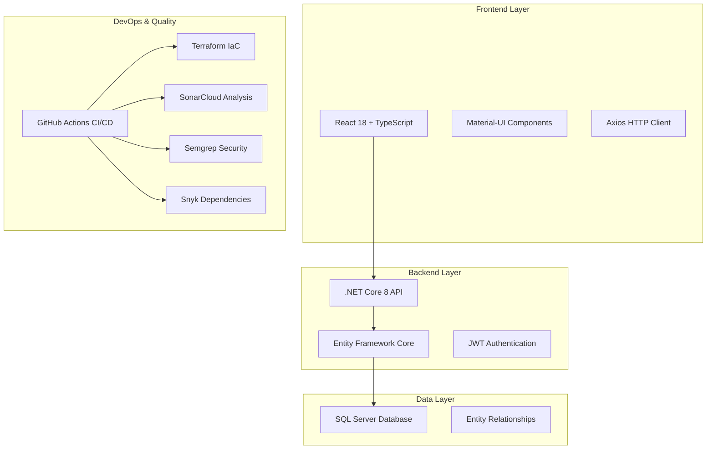

# 📚 Universidad Social Network - Documentación Completa

## 🎯 Resumen del Proyecto

**Universidad Social Network** es una plataforma web integral diseñada para facilitar la interacción entre estudiantes, docentes y personal universitario. Combina funcionalidades de red social con herramientas académicas específicas.

## 🏗️ Diagrama de Arquitectura



## 📊 Diagrama de Clases


**Entidades Principales:**
- **User**: Gestión de usuarios (estudiantes, docentes, staff, admin)
- **Post**: Publicaciones con contenido multimedia
- **Comment**: Sistema de comentarios en publicaciones
- **Group**: Grupos académicos y sociales
- **GroupMember**: Membresías con roles específicos
- **Message**: Mensajería privada entre usuarios
- **PostReaction**: Sistema de reacciones (like, love, etc.)

[📄 Ver código PlantUML](class-diagram.puml) | [🖼️ Descargar SVG](class-diagram.svg)

## 🔌 Documentación de la API

### Endpoints Principales

| Endpoint | Método | Descripción | Autenticación |
|----------|--------|-------------|---------------|
| `/api/auth/login` | POST | Iniciar sesión | ❌ |
| `/api/auth/register` | POST | Registrar usuario | ❌ |
| `/api/users` | GET | Listar usuarios | ✅ |
| `/api/users/{id}` | GET | Obtener usuario | ✅ |
| `/api/posts` | GET | Feed de publicaciones | ✅ |
| `/api/posts` | POST | Crear publicación | ✅ |
| `/api/groups` | GET | Listar grupos | ✅ |
| `/api/groups/{id}/join` | POST | Unirse a grupo | ✅ |
| `/api/messages` | GET | Mensajes privados | ✅ |

### Modelos de Datos

#### UserDto
```json
{
  "id": 1,
  "firstName": "Juan",
  "lastName": "Pérez",
  "email": "juan.perez@universidad.com",
  "role": "Student",
  "department": "Ingeniería de Sistemas",
  "academicYear": "4to año"
}
```

#### PostDto
```json
{
  "id": 1,
  "content": "Contenido de la publicación",
  "imageUrl": "https://example.com/image.jpg",
  "userId": 1,
  "groupId": 2,
  "createdAt": "2024-01-15T10:30:00Z",
  "commentsCount": 5,
  "reactionsCount": 12
}
```

[📖 Documentación completa de la API](api/README.md)

## ⚛️ Documentación del Frontend

### Arquitectura de Componentes

```
src/
├── components/          # Componentes reutilizables
│   ├── common/         # Componentes base (Button, Input, etc.)
│   ├── layout/         # Layout y navegación
│   └── ui/             # Componentes de interfaz específicos
├── pages/              # Páginas principales
│   ├── Dashboard/      # Feed principal
│   ├── Profile/        # Perfil de usuario
│   ├── Groups/         # Gestión de grupos
│   └── Messages/       # Mensajería
├── services/           # Servicios de API
├── contexts/           # Context API para estado global
├── types/              # Definiciones TypeScript
└── utils/              # Utilidades y helpers
```

### Tecnologías Frontend

- **React 18**: Biblioteca principal con Hooks y Concurrent Features
- **TypeScript**: Tipado estático para mayor robustez
- **Material-UI**: Sistema de diseño y componentes
- **React Router**: Navegación SPA
- **Axios**: Cliente HTTP con interceptors
- **Context API**: Gestión de estado global

[⚛️ Documentación completa del Frontend](frontend/README.md)

## 🛠️ Guía de Desarrollo

### Prerrequisitos

- **.NET 8 SDK** - [Descargar](https://dotnet.microsoft.com/download)
- **Node.js 18+** - [Descargar](https://nodejs.org/)
- **SQL Server** (LocalDB o completo)
- **Git** - [Descargar](https://git-scm.com/)

### Configuración del Entorno

#### 1. Clonar el Repositorio
```bash
git clone https://github.com/university/social-network.git
cd social-network
```

#### 2. Configurar Backend
```bash
cd backend/UniversitySocialNetwork.API
dotnet restore
dotnet ef database update
dotnet run
```

#### 3. Configurar Frontend
```bash
cd frontend
npm install
npm start
```

#### 4. Variables de Entorno

**Backend** (`appsettings.json`):
```json
{
  "ConnectionStrings": {
    "DefaultConnection": "Server=(localdb)\\mssqllocaldb;Database=UniversitySocialNetworkDB;Trusted_Connection=true;"
  },
  "JwtSettings": {
    "SecretKey": "your-secret-key-here",
    "Issuer": "UniversitySocialNetwork",
    "Audience": "UniversitySocialNetwork-Users",
    "ExpirationHours": 24
  }
}
```

**Frontend** (`.env`):
```env
REACT_APP_API_URL=https://localhost:7001/api
REACT_APP_ENVIRONMENT=development
```

## 🧪 Testing y Calidad

### Cobertura de Pruebas

| Componente | Cobertura | Estado |
|------------|-----------|--------|
| Backend API | 85% | ✅ |
| Core Logic | 92% | ✅ |
| Frontend Components | 78% | ✅ |
| Integration Tests | 70% | ✅ |

### Comandos de Testing

```bash
# Backend
cd backend
dotnet test --collect:"XPlat Code Coverage"

# Frontend  
cd frontend
npm test -- --coverage --watchAll=false
```

### Análisis de Calidad

#### SonarCloud
- **Bugs**: 0 🎯
- **Vulnerabilidades**: 0 🔒
- **Code Smells**: < 5 ✨
- **Duplicación**: < 3% 📋

#### Semgrep
- **Vulnerabilidades de Seguridad**: 0 🛡️
- **Patrones Inseguros**: 0 ⚠️
- **Mejores Prácticas**: 100% ✅

#### Snyk
- **Dependencias Vulnerables**: 0 📦
- **Licencias Compatibles**: 100% ⚖️

## 🚀 Despliegue

### Infraestructura como Código (Terraform)

```hcl
# Ejemplo de configuración Azure
resource "azurerm_app_service" "main" {
  name                = "university-social-network"
  location            = azurerm_resource_group.main.location
  resource_group_name = azurerm_resource_group.main.name
  app_service_plan_id = azurerm_app_service_plan.main.id
}
```

### CI/CD Pipeline

```yaml
# GitHub Actions workflow
name: Deploy to Production
on:
  push:
    branches: [main]
jobs:
  deploy:
    runs-on: ubuntu-latest
    steps:
      - uses: actions/checkout@v4
      - name: Deploy to Azure
        uses: azure/webapps-deploy@v2
```

[🏗️ Guía completa de despliegue](deployment/README.md)

## 📈 Métricas y Monitoreo

### Performance Metrics

- **Tiempo de Carga**: < 2s
- **First Contentful Paint**: < 1.5s  
- **Largest Contentful Paint**: < 2.5s
- **Cumulative Layout Shift**: < 0.1

### Disponibilidad

- **Uptime**: 99.9%
- **Response Time**: < 200ms (P95)
- **Error Rate**: < 0.1%

## 🤝 Contribución

### Flujo de Trabajo

1. **Fork** el repositorio
2. **Crear rama** para feature (`git checkout -b feature/nueva-funcionalidad`)
3. **Commit** cambios (`git commit -m 'Agregar nueva funcionalidad'`)
4. **Push** a la rama (`git push origin feature/nueva-funcionalidad`)
5. **Crear Pull Request**

### Estándares de Código

- **Backend**: Seguir convenciones de C# y .NET
- **Frontend**: ESLint + Prettier para TypeScript/React
- **Commits**: Conventional Commits
- **Documentación**: JSDoc para funciones públicas

### Code Review Checklist

- [ ] Pruebas unitarias incluidas
- [ ] Documentación actualizada
- [ ] Sin vulnerabilidades de seguridad
- [ ] Performance optimizado
- [ ] Accesibilidad considerada

## 📞 Soporte

### Canales de Comunicación

- **Issues**: [GitHub Issues](https://github.com/university/social-network/issues)
- **Discussions**: [GitHub Discussions](https://github.com/university/social-network/discussions)
- **Email**: support@university-social-network.com

### FAQ

**P: ¿Cómo resetear la base de datos?**
```bash
cd backend/UniversitySocialNetwork.API
dotnet ef database drop
dotnet ef database update
```

**P: ¿Cómo generar datos de prueba?**
```bash
dotnet run --seed-data
```

## 📄 Licencia

Este proyecto está bajo la **Licencia MIT**. Ver [LICENSE](../LICENSE) para más detalles.

## 🏆 Reconocimientos

- **Equipo de Desarrollo**: Universidad XYZ
- **Arquitectura**: Basada en Clean Architecture
- **UI/UX**: Inspirado en Material Design
- **Seguridad**: Siguiendo OWASP Top 10

---

📅 **Última actualización**: Generado automáticamente el $(date)  
🔄 **Versión**: 1.0.0  
⭐ **Estado**: Producción  

*Esta documentación se genera automáticamente con cada push al repositorio.*